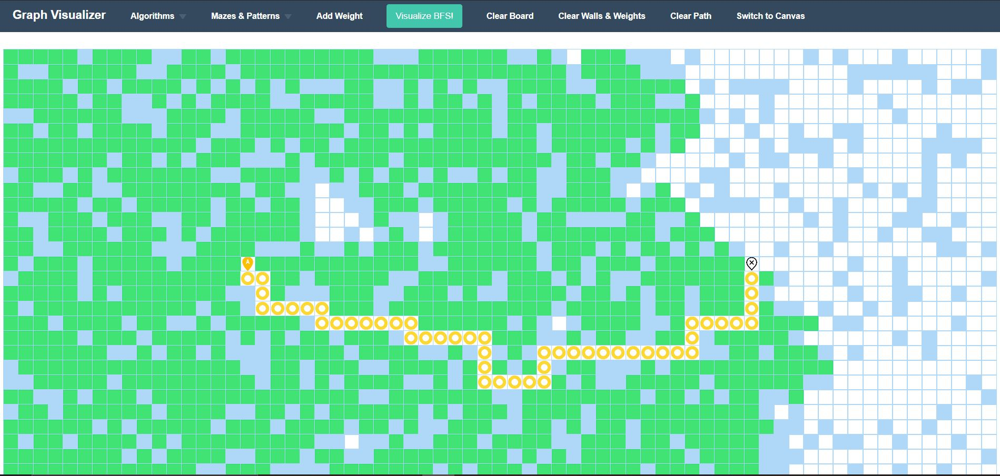
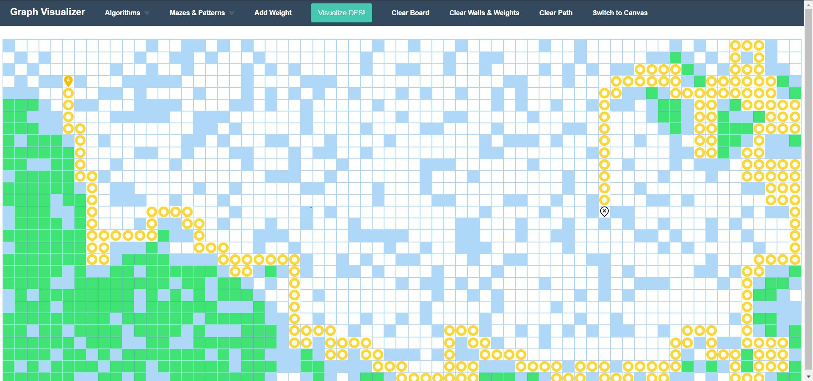
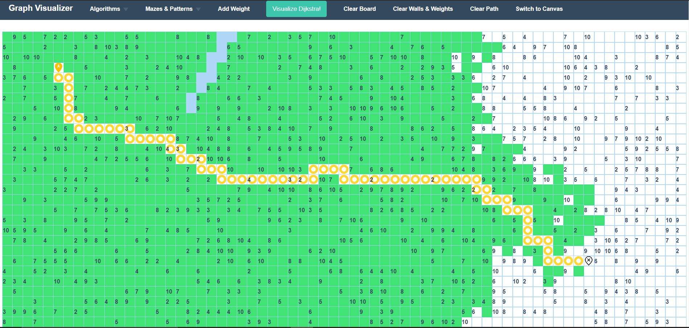
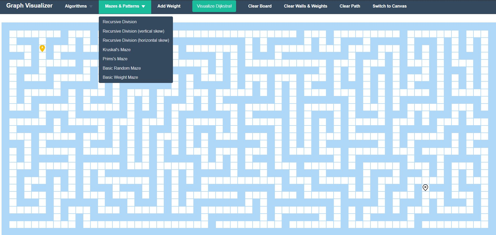
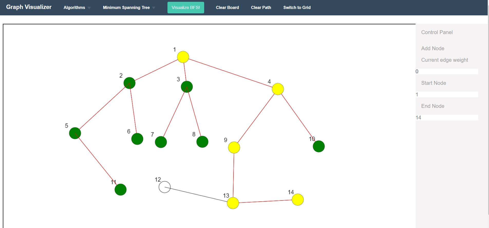
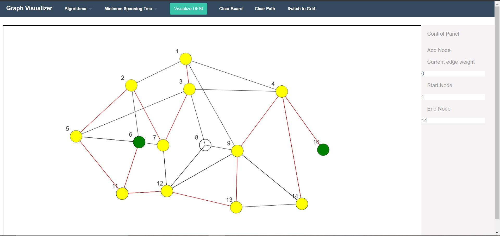
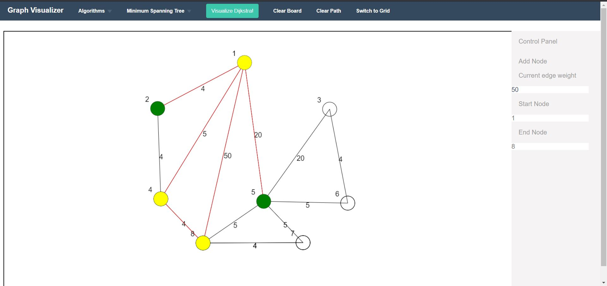
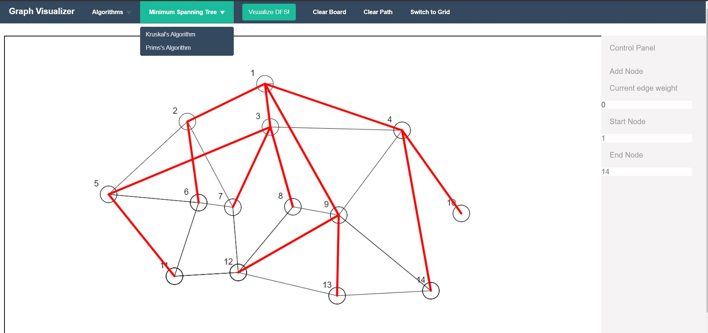

## Project consists of two sections:- 

### 1. Grid
Initially on the grid you will see a start point and an end point. You can drag and drop the points anywhere on the grid.
Each cell in the grid represents a node. You can modify the properties of a cell by either making it a wall or increasing it weight.

You can choose from the **Algorithms** that you want to visualise and then **Visualise** button will animate the path search procedure from start node to end node using the corresponding algorithm.

You can turn the grid into mazes obtained by different Algorithms like **Recursive Backtracking** or **Kruskal's Algorithm** or **Prim's Algorithm** and many others.

#### BFS

#### DFS

#### Dijkstra

#### Mazes

### 2. Canvas
It is basically a canvas on which you can draw a graph of any kind you want. You can draw nodes and the connect the with edges.
After that you can set start and end node and then select an algorithm to visualise the working of that algorithm.
you can also visualize the working of Kruskal's Algorithm and Prims Algorithm for Minimum Spanning Tree.

#### BFS

#### DFS

#### Dijkstra

#### Minimum Spanning Tree Algorithms

### Contributers:
- [Uttam Singh Chauhan](https://github.com/uttam0912 "Uttam Singh Chauhan")
- [Satveer Saini](https://github.com/satveersaini "Satveer Saini")
- [Sangramsinh V Patil ](https://github.com/sangramsinh96 "Sangramsinh V Patil")
- [Samiran Doley](https://github.com/Samirandoley "Samiran Doley")
